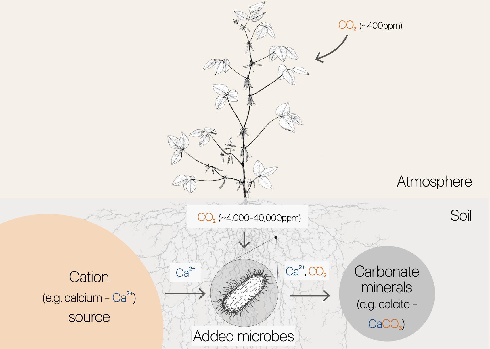
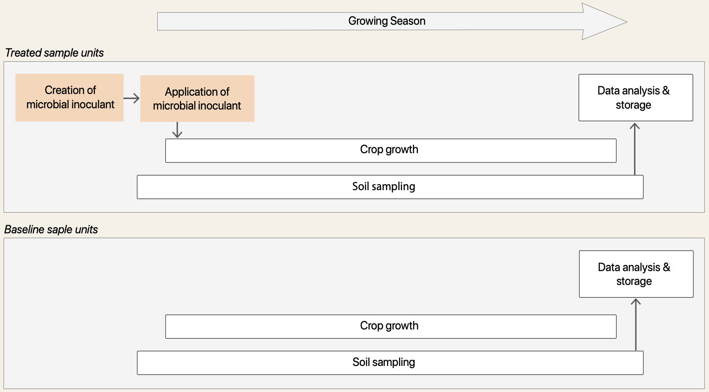
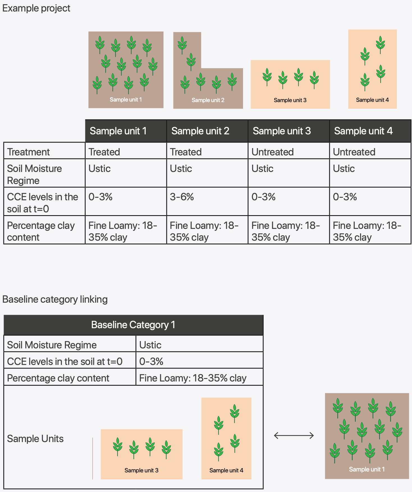
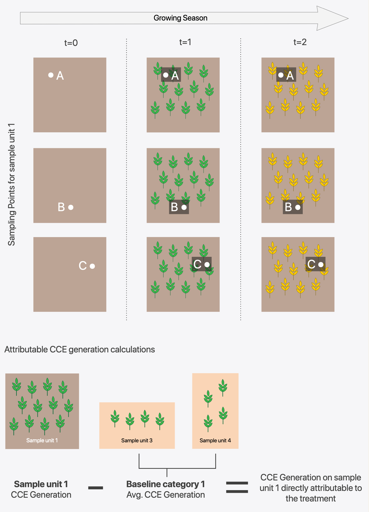
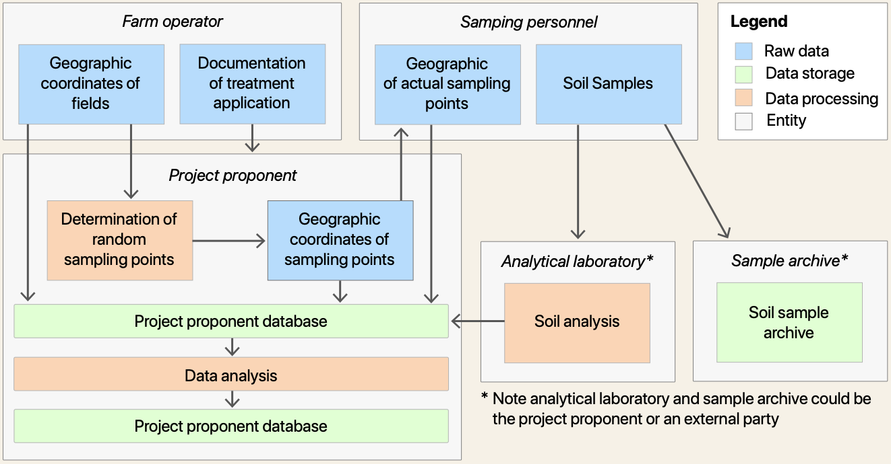
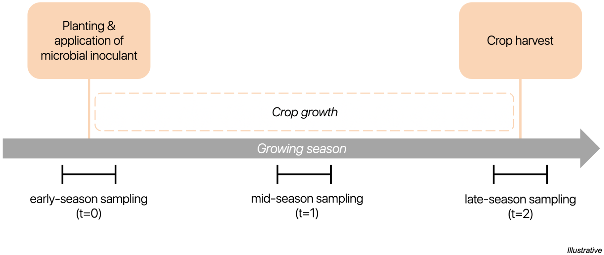

## Summary Description

Version 1.0 of this methodology was developed by Andes and EcoEngineers. This document is currently under validation by Earthood in accordance with [ISO 14064-2:2019](https://www.iso.org/standard/66454.html).

The Microbial Carbon Mineralization Methodology provides procedures to quantify the greenhouse gas (GHG) removals resulting from soil inorganic carbon (SIC) increases attributable to the usage of a microbial inoculant on agricultural fields. It provides guidance to quantify, report, and verify carbon dioxide removals (CDR) generated through these practices. The SIC gains from the specific microbial activity are measured and attributed to the credits through the specified monitoring protocol. Before the start of the project, the ability of the microbial inoculant to fix CO₂ from the atmosphere needs to be demonstrated in lab and field studies. Credits are determined by measuring the difference in SIC generation between fields treated with microbial inoculant and untreated fields (i.e., baseline scenario).

<figure>
  
  <figcaption>
    **Figure 1**  
    Illustration Demonstrating Use of Microbes for Carbon Dioxide Removal
  </figcaption>
</figure>

This methodology, written in alignment with ISO 14064-2:2019, provides rules for eligibility, means of quantification, monitoring instructions, reporting requirements, and verification parameters. All projects will receive independent validation following procedures outlined under [ISO 14064-3:2019](https://www.iso.org/standard/66455.html). This methodology and associated measurement/quantification approach will be refined and improved over time following the best available science.

This version of the methodology (v1.0) exclusively follows a direct sampling approach and excludes removals from soil pools deeper than the reference sampling depth (i.e., 12 inches). Due to the nature of SIC generation and its permanence via these pathways, this methodology is intended for projects in areas with neutral to high soil pH. No avoided emissions credits will be generated due to the displacement of traditional nitrogen fertilizer, increased agriculture yields,
or other farm practices. CO₂ is the only GHG considered for sinks & reservoirs and only demonstrated increases in SIC attributable to microbial inoculant are credited.

The baseline scenario assumes the continuation of pre-project agricultural management practices and project activities may be combined with other beneficial farm practices. The methodology can be compatible with separate regenerative agriculture programs and practices (e.g., no-tillage, cover crops). Additionality is illustrated via a combined regulatory surplus and positive list.

Projects may be single fields or span multi-fields over multiple years with a monitoring period throughout the agricultural growing season. The exact monitoring period will differ depending on the project location and should correspond with the growing season (e.g., typically spring to fall in the US Midwest).

As farm operators join or leave the program, fields may be added or subtracted to a project for the purpose of validation/verification provided all monitoring requirements are met. Projects are valid for 5 years and can be renewed once.

<figure>
  
  <figcaption>
    **Figure 2**  
    General Overview of Key Project Activities
  </figcaption>
</figure>

### Relationship to Existing Methodologies

<table>
  <thead>
    <tr>
      <th>Program</th>
      <th>Methodology</th>
      <th>Relevance</th>
      <th>Disqualification</th>
    </tr>
  </thead>
  <tbody>
    <tr>
      <td>Verified Carbon Standard</td>
      <td>VM0042 Methodology for Improved Agricultural Land Management v2.0</td>
      <td>
        Crediting of carbon removals resulting from the adoption of land
        management practices to increase SOC (and thereby store atmospheric
        CO₂).
      </td>
      <td>
        The methodology does not address the application of microbial inoculant
        to increase SIC. Also, the methodology only considers soil organic
        carbon (SOC) generation.
      </td>
    </tr>
    <tr>
      <td>Climate Action Reserve</td>
      <td>Soil Enrichment Protocol; Version 1.1</td>
      <td>
        Crediting of carbon removals resulting from the adoption of land
        management practices to increase SOC (and thereby store atmospheric
        CO₂).
      </td>
      <td>
        The methodology does not address the application of microbial inoculant
        to increase SIC. Also, the methodology only considers SOC generation.
      </td>
    </tr>
    <tr>
      <td>Gold Standard for the Global Goals</td>
      <td>Soil Organic Carbon Framework Methodology; Version 1.0</td>
      <td>
        Crediting of carbon removals resulting from the adoption of land
        management practices to increase SOC (and thereby store atmospheric
        CO₂).
      </td>
      <td>
        The methodology does not address the application of microbial inoculant
        to increase SIC. Also, methodology only considers SOC generation.
      </td>
    </tr>
    <tr>
      <td>Puro Standard</td>
      <td>Enhanced Rock Weathering Methodology; Edition 2022</td>
      <td>
        Crediting of carbon removals resulting from applying crushed rock or
        other material to soil to increase SIC (and thereby store atmospheric
        CO₂).
      </td>
      <td>
        The methodology does not address the application of microbial inoculant
        to increase SIC.
      </td>
    </tr>
  </tbody>
</table>

## Definitions

**Agricultural land:** Land dedicated to agricultural production, including arable land, permanent cropland, and permanent pastures.

**Alkalinity runoff:** Water containing bicarbonate and carbonate ions that is leaving the open soil system.

**Baseline area:** Agricultural land used as a reference or control for the treated project area. This area should meet all applicability conditions except for the condition requiring application of a microbial inoculant for increasing SIC see [condition 1 in Section 3](#applicability-conditions).

**Baseline sample unit:** A sample unit with no microbial inoculant applied, serving as a reference or control to compare against treated sample units.

**Calcium Carbonate Equivalent (CCE):** the quantity of carbonate (CO32-) in the soil expressed as CaCO3 and as a weight percentage of the less than 2 mm soil size fraction. CCE represents all inorganic carbon molecules, including carbonate minerals and bicarbonate.

**Carbon Dioxide Removal (CDR):** The process as well as the quantity of carbon dioxide (CO₂ ) removed from the atmosphere due to project activities, typically measured in metric tonnes. This term will be used interchangeably with GHG removal.

**Cation Exchange Capacity (CEC):** A measure of how many cations can be retained on soil particle surfaces. It influences the soil's ability to hold onto essential nutrients and provides a buffer against soil acidification.

**Cropland:** A land cover/use that includes areas used to produce adapted crops for harvest.

**Existing cropland:** Land that functioned as cropland prior to the project’s start date, serving as a reference point for evaluating project applicability.

**Farm operator:** A person who runs the farm, making day-to-day management decisions. An operator could be an owner, hired manager, cash tenant, share tenant, and/or a partner, as defined by the USDA Economic Research Service glossary.

**Field strata:** Refers to the strata defined within a field, usually established through stratified random sampling.

**Growing season:** A period within a year during which growing conditions for crops are most favorable. The length of the growing season can vary significantly depending on geographical location, climate, and specific crop requirements. The growing season in the US Midwest typically occurs from late spring to early fall.

**Greenhouse gas (GHG):** A gaseous constituent of the atmosphere, both natural and anthropogenic, that absorbs and emits radiation at specific wavelengths within the spectrum of infrared radiation emitted by the Earth’s surface, the atmosphere and clouds. GHGs include carbon dioxide (CO₂ ), methane (CH 4 ), nitrous oxide (N₂O), hydrofluorocarbons (HFCs), perfluorocarbons (PFCs) and sulfur hexafluoride (SF 6 ).

**Microbial inoculant:** A specific microbe or group of microbes intentionally introduced into the soil to promote the generation of soil inorganic carbon on agricultural lands.

**Monitoring intervals:** The time intervals between consecutive monitoring events or data collection points.

**Monitoring plan:** The guidance document that auditors shall use to develop a project-specific risk assessment and sampling plan. This will be incorporated into the Project Design Document.

**Project area:** Agricultural land subject to microbial inoculant application to generate soil inorganic carbon and meet all applicability conditions.

**Project Design Document (PDD):** The project document presented for validation which encompasses the plan for adherence to the requirements of this methodology.

**Project proponent:** The party responsible for documentation preparation, aggregation, and submittal to validation and verification body and to whom carbon dioxide removal credits are issued.

**Sample unit:** A defined area selected for measurement and monitoring, such as a specific section of a field. In the context of stratified random sampling, sample units refer to the field strata.

**Sampling point:** A predetermined location within a field or stratum where soil samples are collected for analysis.

**Soil Inorganic Carbon (SIC):** The collective term for all inorganic carbon molecules in the soil, encompassing carbonate minerals and bicarbonate. SIC is commonly measured and quantified as Calcium Carbonate Equivalent.

**Soil Organic Carbon (SOC):** Synonymous with Total Organic Carbon, referring to the carbon content stored within soil organic matter.

**Soil Organic Matter (SOM):** Material originally produced by living organisms that becomes incorporated into the soil and undergoes decomposition. Examples include plant roots, microbes, and other organic residues.

**Soil pH:** An indication of the acidity or alkalinity of soil and is measured in pH units. Soil pH is defined as the negative logarithm of the hydrogen ion concentration.

**Stakeholders:** Farm operators involved in applying the microbial inoculant on their land.

**Stratification:** The process of dividing a larger area or population into distinct subgroups or strata based on specific criteria or variables. Stratification aims to create homogeneous subgroups that share similar attributes within themselves while exhibiting differences between the subgroups, facilitating more accurate analysis, sampling, and understanding of the underlying patterns or characteristics within the larger population or area.

**Strata (singular: stratum):** The distinct subgroups created through the stratification process, each characterized by specific attributes or criteria.

**Treated sample unit:** A sample unit where a microbial inoculant has been applied for experimental or treatment purposes.

**Total Carbon:** The sum of both organic and inorganic carbon present in a given system or sample.

**Total Organic Carbon (TOC):** The amount of carbon stored within soil organic matter, derived from the decomposition of plant and animal residues, root exudates, living and deceased microorganisms, and soil biota.

**Validation and Verification Body (VVB):** Qualified and independent third-party auditors certified under ISO 14064-3, responsible for assessing and confirming the greenhouse gas statement of the project.

## Applicability Conditions

This methodology is global in scope and pertains to the application of a specific microbial inoculant intended to increase SIC on agricultural soils. The generation of SIC relates to the removal of CO₂ compared to the baseline scenario. This methodology is applicable if the following conditions are met:

1. Projects must apply a microbial inoculant that leads to SIC generation.
2. Project activities must be implemented on existing cropland at the project start date which must remain cropland throughout the project monitoring period.
3. The project area must be on non-irrigated cropland (i.e., fully rainfed).

The methodology is **not** applicable if any of the following conditions are met:

1. Agricultural limestone or other carbonate minerals applied the same year microbial inoculant is applied on the project area.
2. Project sites are enrolled in additional SIC generation programs.

Each treated field strata must meet the above applicability conditions. All applicability conditions, except condition requiring the application of a microbial inoculant for SIC generation (Applicability Condition #1), must be met for the baseline area (i.e., all baseline sample units).

## Project Proponent Description

The project proponent must provide the following information in the Project Design Document (PDD):

- Roles and responsibilities, including contact information of the project proponent
- Evidence to confirm compliance with applicability conditions
- High level projection of tonnes per year over the lifetime of the project
- Description of planned (or completed) activities, including:
  - Description of the microbial inoculant applied and associated timing of the inoculant application
  - Initial number of fields to be included in project with location information
  - Date of project start
  - Date of project termination
  - Frequency of monitoring
  - Frequency of planned verification and validation
  - Description of how the applicability requirements are met for project area (i.e., field(s))
- If requested by the verification body, project proponent will share contact information of the farm operators where project activities take place
- Documentation supporting ownership of CDR credits
- Quantification of emission removals using the equations in the methodology
- Review of local and other relevant regulations in order to confirm regulatory surplus

## Project Boundary

### Carbon Pools

This methodology focuses only on the benefits of an increase of SIC pools. Therefore, accounting for generated CDR credits is limited to the SIC pool as shown in Table 2.

**Table 2**

<figure>
  <table>
    <thead>
      <tr>
        <th>Pool</th>
        <th>Description</th>
        <th>Included?</th>
        <th>Justification</th>
      </tr>
    </thead>
    <tbody>
      <tr>
        <td>Above ground</td>
        <td>
          Stem, branches, bark, grass, crop biomass, and other organic matter
          containing materials.
        </td>
        <td>No</td>
        <td>
          Carbon pool not included because it does not contain inorganic carbon.
        </td>
      </tr>
      <tr>
        <td>Below ground</td>
        <td>
          Roots of grass, trees, herbs, crop biomass, and other organic matter
          containing materials.
        </td>
        <td>No</td>
        <td>
          Carbon pool not included because it does not contain inorganic carbon.
        </td>
      </tr>
      <tr>
        <td>Litter</td>
        <td>
          Leaves, fallen branches, and other organic matter containing
          materials.
        </td>
        <td>No</td>
        <td>
          Carbon pool not included because it does not contain inorganic carbon.
        </td>
      </tr>
      <tr>
        <td>Soil organic carbon</td>
        <td>
          Carbon pool not included because it does not contain inorganic carbon.
        </td>
        <td>No</td>
        <td>
          Carbon pool not included because it does not contain inorganic carbon.
        </td>
      </tr>
      <tr>
        <td>Soil inorganic carbon</td>
        <td>
          All inorganic carbon molecules in the soil, encompassing carbonate
          minerals and bicarbonate.
        </td>
        <td>Yes</td>
        <td>
          Major carbon pool affected by project activity that is expected to
          increase in treated fields.
        </td>
      </tr>
      <tr>
        <td>Wood products</td>
        <td>
          Standing and lying wood, as well as other wood-derived organic matter
          containing materials.
        </td>
        <td>No</td>
        <td>
          Carbon pool not included because it does not contain inorganic carbon.
        </td>
      </tr>
    </tbody>
  </table>
  <figcaption>
    **Table 2**  
    Selected Carbon Pools
  </figcaption>
</figure>

The primary greenhouse gas monitored (non-emission source) with all SIC project activities is CO₂. For GHG emissions sources, CO₂e is used. To confirm project N₂O and CH4 emissions due to microbial activities are immaterial, project proponents shall submit supporting documentation in the Project Design Document. Project proponents may incorporate sources, sinks, and reservoirs (SSRs) outlined in an ISO 14044-based Life Cycle Assessment or similarly rigorous accounting system but must include the SSRs identified in Table 3.

<figure>
  <table>
    <thead>
      <tr>
        <th>SSR</th>
        <th>Type</th>
        <th>GHG</th>
        <th>Status for CDR accounting</th>
      </tr>
    </thead>
    <tbody>
      <tr>
        <td rowSpan="5">Emission Sources</td>
        <td>Microbial inoculant production & packaging</td>
        <td>CO₂e</td>
        <td>Declared</td>
      </tr>
      <tr>
        <td>Product distribution</td>
        <td>CO₂e</td>
        <td>Declared</td>
      </tr>
      <tr>
        <td>Field application</td>
        <td>CO₂e</td>
        <td>Declared</td>
      </tr>
      <tr>
        <td>Soil sampling (includes associated transportation)</td>
        <td>CO₂e</td>
        <td>Declared</td>
      </tr>
      <tr>
        <td>Soil processing</td>
        <td>CO₂e</td>
        <td>Declared</td>
      </tr>
      <tr>
        <td>Reservoirs</td>
        <td>Soil inorganic carbon</td>
        <td>CO₂</td>
        <td>Declared</td>
      </tr>
    </tbody>
  </table>
  <figcaption>
    **Table 3**  
    Sources, Sinks, and Reservoirs
  </figcaption>
</figure>

### Spatial Boundary

The spatial extent of the project boundary encompasses agricultural land, specifically cropland, subject to the implementation of the microbial inoculant that aids in the generation of SIC measured as CCE. There is no maximum project area if the applicability conditions are met.

### Temporal Boundary

The temporal boundary will be from the start to the end of the growing season. The length of monitoring will be based on confirmed trials of duration between application and substantial SIC generation. A conservative estimate of the time needed to reach a substantial and detectable generation of SIC will be reported as described in the project monitoring section. The project proponent should monitor the SIC generation at intervals throughout the growing season to capture its increase driven by the application of the microbial inoculant.

### Project Crediting Period

A project design document in relation to this methodology is valid for up to 5 years from the project start date. The period can be renewed once, therefore valid for up to 10 years.

### Project Monitoring Period

The monitoring period should be one growing season, from before the microbial inoculant application or soon after (early-season) until the crop reaches maturity or post-harvest (late-season).

### Project Start Date

In a single field, single year project, the project start date is determined by the date of microbial application on that field. In a multi-field project spanning different years and seasons, the project start date is determined by the earliest microbial application date within the included fields. Typically, this date coincides with the crop planting date, as the microbial inoculant is applied at that time.

Validating the start date can be achieved through various means, such as time-stamped photographs, attestations from the farm operator, or written documentation that details the treatment of the field with the microbial inoculant. These pieces of evidence serve to establish a clear record of when and how the microbial treatment took place, ensuring transparency and credibility in determining the project's initiation.

Project must undergo validation within 3 years from project start date.

## Baseline Scenario

The baseline scenario is the continuation of standard agricultural practices, without the application of a microbial inoculant for increasing SIC. Untreated sample locations are used to represent SIC generation in the absence of project activities. These untreated sample units, which have representative soil types and conditions compared to treated sample units, are used to isolate the dependent variable, SIC generation attributable to the microbial inoculant treatment. See [Section 11](#cdr-quantification) for more details. To quantify the tonnes of CO₂ removed, SIC generation on treated sample units throughout the growing season is compared to SIC generation on baseline sample units with the same key properties (see [Table 5 in Section 11](#cdr-quantification)). All applicability conditions except the condition requiring the application of a microbial inoculant that increases SIC (Applicability Condition #1) must be met for the baseline area (i.e., all baseline sample units).

For projects using this methodology, it is recommended that the baseline area represents approximately 5-10% of the total project area. These baseline sample units may relate to an entire field or part of a field.

See [Section 11](#cdr-quantification) and [Section 13](#monitoring) for baseline quantification and baseline sampling approach.

## Permanence

Increases in SIC measured in the soil during the project time frame will predominantly be carbonate minerals. Carbonate minerals have low solubility in water, and migration through the soil can be slow. Bicarbonate is highly water-soluble and will percolate to deeper soil horizons relatively fast.

Carbonate minerals result from the reaction of bicarbonate with available cations such as calcium (Ca²⁺) and magnesium (Mg²⁺) to form minerals such as calcium carbonate (CaCO3) or dolomite (CaMg(CO3)2). In soils with high total cation content (e.g., due to a high CEC and an abundance of cation-bearing silicates) this reaction is favored. Carbonate minerals (e.g., CaCO3) will redissolve to generate bicarbonates (e.g., calcium bicarbonate) with the introduction of CO₂ dissolved in rainwater. This occurs through the following chemical reactions (Sanderman, 2012):

$$
CO_2 + H_2O \rightarrow H^+ + HCO_3^−
$$

$$
CaCO_3 + H+^ + HCO_3^- \rightarrow Ca^{2+} + 2HCO_3^-
$$

As calcium bicarbonate (Ca(HCO₃)₂) is highly soluble in water, it will migrate into the subsoil with sufficient rainfall. With lower partial pressure of CO₂ (pCO₂) and water content, the calcium bicarbonate may reprecipitate and reform a molecule of calcium carbonate (CaCO3), releasing a molecule of CO₂ in the process. By dissolving calcium carbonate (CaCO3) into calcium bicarbonate (Ca(HCO₃)₂) there is a transient capture of an additional CO₂ molecule (two molecules in total) which is released back to the system once the calcium bicarbonate (Ca(HCO₃)₂) reprecipitates into calcium carbonate (CaCO3). In summary, one molecule of CO₂ remains captured in the overall process (dissolution and precipitation).

The formation of terrestrial carbonate minerals depends on the source for cations, carbonate saturation state, and other local environmental conditions. Although carbonate minerals in the soil can have complex dynamics of dissolution and reprecipitation, there is a high likelihood of long-term durability (Chay et al., 2023). To favor the stability of bicarbonate and carbonate minerals, ideal soils are those with an average pH greater than 6.36 (Lindsay, 1979). In soils with a high buffering capacity (explained by a high content of primary minerals and carbonate minerals) as well as a near-neutral to alkaline pH and available exchangeable cations, carbonate minerals will likely accumulate in deeper horizons. The average turnover time of SIC in these calcium carbonate rich horizons globally has been estimated to be tens of thousands of years (Schlesinger, 1985). In some instances, carbonate minerals will eventually be exported from soils as water-soluble bicarbonate and end up in groundwater, rivers, and oceans. While the majority of bicarbonate in this instance will reach oceans and have durability of 10,000+ years (Kanzaki et al., 2023), some outgassing (evasion) may occur when groundwater reaches surface water and equilibrates with the atmosphere, experiences pH shifts, or interacts with the surface ocean (Chay et al., 2023). This scenario of alkalinity runoff leakage is accounted for in the uncertainty discount (see [Section 10](#risks-and-uncertainty-discount)).

For purposes of crediting, carbon dioxide removals are considered to be functionally permanent once shown to be incorporated into soils. Due to the inevitable uncertainties of carbon flows through natural systems, identifying and tracing small-scale reversals to their causal basis is often difficult or impossible. Recognizing that some reversals of CaCO3into CO₂ may occur regardless of any safeguards and guidelines introduced, this methodology utilizes an uncertainty discount based on the CDR verification framework and a conservative assessment of possible reversal scenarios (see [Section 10](#risks-and-uncertainty-discount)).

Project proponents shall describe all measures taken to reduce the risk of reversal. Examples of measures proponents can take are described in [Table 3 in Section 10](#risks-and-uncertainty-discount). The applicability conditions under this methodology will ensure most reversals are avoided; however, project proponents must have safeguards described as to specific practices employed to minimize the risk of reversals.

## Additionality

### Requirements for Additionality

**1. Regulatory: Project shall not be the result of compliance with any mandated law, statute, or other regulatory framework.**

The project activity of using a microbial inoculant to generate SIC, sequestering CO₂ permanently in the soil, is a novel approach. Whereas the absence of governmental acknowledgment does not alone guarantee additionality, the absence of such regulations pertaining to mandatory usage of SIC-enhancing microbes, along with the absence of prohibitions of the same, are required for projects to meet this regulatory additionality requirement for crediting.

**2. Positive List**

The project must demonstrate that it meets all applicability conditions, and in so doing, it is deemed as complying with the positive list and as being additional. The activity penetration of this method is assumed to be near-zero at the time of the release of this methodology, and therefore activities meeting the conditions of eligibility are likely to be additional to any existing project and any project within 5 years after the methodology is published. The project will revisit the additionality baseline every 5 years to ensure that the project activity is still additional.

### Credit and Payment Stacking

Projects generating credits under this methodology must demonstrate that there is no double counting of carbon/environmental benefits if combined with other credit types. Practices leading to increased SIC content instead of SOC are distinctly different and are logically separated into individual crediting programs. Growers can conduct regenerative agriculture practices under this methodology. Still in these instances, if credit stacking is desired, it must be clearly delineated and proven to the Verification and Validation Body (VVB) where the credits are being claimed. Examples of eligible programs would include those not specifically tied to carbon benefits, e.g., EPA Climate Smart Ag, regenerative ag programs.

Generally speaking, there are no restrictions on either payment or credit stacking under this methodology. In cases where payments or credits are attributed to CO₂ removed, payment or credit stacking is permitted when credits are clearly delineated by the project. Any type of conservation or ecosystem service payment or credit received for activities on the project area must be disclosed by the project proponent to the verification body on an ongoing basis.

## Leakage

There are two leakage types considered for this project.

**Economic leakage:** This describes the risk of affecting GHG emissions that might be shifted outside the system boundaries of the project due to its implementation. Economic leakage is separate from the life cycle assessment (LCA) which includes emissions directly resulting from the implementation of the project (e.g., transportation). Leakage common to AFOLU methodologies is unlikely to occur for projects within this methodology. One potential leakage scenario for this project is the risk of indirect land use change in a scenario where an agricultural field is newly created for purposes of CDR (carbon dioxide removal) generation. To address this, fields must have been in agricultural use prior to the project start date and may not be newly converted. Similarly, fields should not be converted from one crop to another to maximize CDR yield at the expense of the original commodity crop. As there are carbon intensity differences between crops due to production cycles and other inputs, it is worth consideration, however, the scenario is unlikely and impact on net CDR generation is likely de minimis. Where available, records of crop rotation, satellite images, or attestations may be used as evidence of continuity of agricultural activity.

**Physical leakage:** This describes the risk of reversal or re-emission that could occur when carbon that is sequestered due to the CDR project is released back into the atmosphere. Certain field management practices fall into this category (such as soil acidification due to nitrogen application) and these will be compensated for in the overall uncertainty discount percentage that is applied in [Section 11](#cdr-quantification) (CDR Quantification).

## Risks and Uncertainty Discount

All risks that have been identified, along with suggested mitigations and level of impact on the removal calculation, are detailed in Table 4.

<figure>
  <table>
    <thead>
      <tr>
        <th>Risk</th>
        <th>Description and potential mitigation</th>
        <th>Level of impact on removal calculation</th>
      </tr>
    </thead>
    <tbody>
      <tr>
        <td>Soil heterogeneity</td>
        <td>
          Heterogeneity exists in soil inorganic carbon even within field
          strata. To address this risk, the project proponent should conduct the
          rigorous soil sampling procedures following best practices outlined in
          this methodology. This procedure consists of stratification of fields
          based on soil texture, random determination of sampling locations, and
          composites of 5-12 cores for each sampling location (see [Section
          13](#monitoring) for more details).
        </td>
        <td>Medium</td>
      </tr>
      <tr>
        <td>Soil carbonate durability</td>
        <td>
          There is a high likelihood of long-term durability of the carbonate
          minerals formed (Chay et al., 2023). Through dynamics of dissolution
          and reprecipitation, carbonate minerals may dissolve to form
          water-soluble bicarbonates and move deeper into the soil over time
          (Sanderman, 2012). However, over the thousands of years of durability
          proposed, acidification (e.g., application of nitrogen fertilizers,
          acid rain) could pose a potential risk to the stability of a small
          portion of the carbonate minerals in the soil. To favor the stability
          of bicarbonate and carbonate minerals, ideal soils are those with an
          average pH greater than 6.36 (Lindsay, 1979).
           
            In regards to acid rain, Environmental initiatives such as the
          Clean Air Act have led to a significant reduction in sulfur dioxide
          and nitrogen oxide pollutants in the United States and Europe. As a
          result, the risk of acid rain in these regions is now minimal,
          ensuring projects there have a negligible risk of reversal due to acid
          rain. For other regions, the potential impact of this risk should be
          assessed and no projects should be implemented in high-risk areas.
        </td>
        <td>Low</td>
      </tr>
      <tr>
        <td>Alkalinity runoff leakage</td>
        <td>
          Leakage may occur from outgassing of alkalinity runoff if carbonate
          minerals dissolve into water-soluble bicarbonate and reach groundwater
          before reprecipitating to carbonate minerals. In this instance, some
          outgassing may occur when groundwater reaches surface water and
          equilibrates with the atmosphere, experiences pH shifts, or interacts
          with the surface ocean (Chay et al., 2023). It is recommended the
          project proponent apply its microbes on fields with a near-neutral to
          alkaline pH with an abundance of cations. In these environments
          alkalinity runoff leakage is a low risk to durability as these
          environments favor the precipitation of carbonate minerals and its
          associated long term storage in the soil.
        </td>
        <td>Low</td>
      </tr>
      <tr>
        <td>Impact on soil health</td>
        <td>
          Given the novel approach, it is vital to ensure that this CDR pathway
          does not harm long-term soil health (e.g., SOC levels, microbiota
          diversity, reduction of basic cations) and crop yield. This risk is
          focused on the impact of the pathway by which the carbonates are
          generated, rather than any risk posed by presence of the carbonates
          themselves. Both historical agricultural practices and literature
          support the benefits of carbonates in soils. Limestone (calcium
          carbonate) has been used historically by farm operators to improve
          soil structure (among other benefits). Literature supports the
          benefits of carbonate minerals in the soil (Fernández-Ugalde et al,
          2014; Rowley et al, 2018; Raza et al, 2021).
           
           
          With regard to the impact of the microorganisms on soil health, it is recommended
          that the project proponent select microorganisms belonging to taxonomic
          groups that have been studied and/or reported for their non-detrimental
          effect on soil and plant health.
           
           
          With regard to potential impact of this pathway on SOC and cations, it
          is recommended that the project proponent monitor SOC levels and the
          cation exchange capacity (CEC) on the project area.
        </td>
        <td>
          Not applicable - risk will not impact carbon removal calculation /
          accounting
        </td>
      </tr>
    </tbody>
  </table>
  <figcaption>
    **Table 4**  
    Project Risks with Suggested Mitigation and Impact
  </figcaption>
</figure>

Taking into account the open-system nature of this project and the complex interaction of carbon fluxes in soil, an "uncertainty discount" has been incorporated into this methodology. This uncertainty discount relates to the risks, recommended mitigations and associated level of impact on removal calculation detailed in Table 4, as some risks are estimated to impact the calculations of tonnes of CO₂ removed. The purpose of this discount, which is commonly used in various sectors to address uncertainty, is to be conservative in carbon removal accounting. Lessons from leaders in the CDR field, such as CarbonPlan and Frontier, have informed the application of this concept.

In this methodology’s current version (v1.0), the uncertainty discount to be applied to all CDR credits generated is 30%. This value is a conservative estimate and related to the specific pathway risks, as detailed in Table 4. In future versions of the methodology, efforts will be made to better map uncertainties associated with this pathway by partnering with additional third-party entities. As more research areas are explored, an accumulation of field data is verified, overall scientific knowledge advances, and previously unknown factors are uncovered, the expectation is that the uncertainty discount will decrease over time.

Overall, the inclusion of an uncertainty discount in this methodology acknowledges the complexities and evolving nature of the field, and it aims to provide a conservative estimate of carbon removal while accounting for uncertainties.

## CDR Quantification

This version of the methodology exclusively follows a direct sampling approach. It is recognized that the approach of direct sampling, and the corresponding calculations below, is a conservative approach to calculating CO₂ removed. It is conservative as it only includes the CO₂ removed that is directly measured. Any SIC (measured as CCE) generated that percolates into soil horizons deeper than what is directly measured is not included in the CO₂ removal calculation. As a result, this approach likely undercounts the amount of CO₂ removed.

To quantify the tonnes of CO₂ removed, SIC generation on treated sample units throughout the growing season is compared to average SIC generation on baseline sample units with the same key properties. The baseline area represents land with similar conditions to treated fields, except for the application of the microbial inoculant. All baseline sample units are grouped into baseline categories determined by key similarity criteria, detailed in Table 5. When calculating the CO₂ removed from the atmosphere resulting from the application of microbial inoculant, individual treated sample units are linked to a single baseline category that meets its similarity criteria detailed in Table 5. It is likely that multiple sample units will be linked to the same baseline category. There also is the possibility that within the project there are baseline sample unit categories without any baseline sample units and associated data. In these instances, any treated sample units that link with such baseline categories (i.e., categories without any representative baseline sample units) will not be included in the CO₂ removal calculations. The purpose of baseline categories is to increase the sample size used as a baseline while isolating the land with the same key characteristics.

<figure>
  <table>
    <thead>
      <tr>
        <th>Baseline Category Similarity Criterion</th>
        <th>Description</th>
      </tr>
    </thead>
    <tbody>
      <tr>
        <td>USDA Soil Moisture Regime Class</td>
        <td>
          USDA Soil Moisture Regime Class is the same as the linked treated
          sample units. Applicable USDA Soil Moisture Regime Classes are as
          follows:
          <ul>
            <li>Aridic</li>
            <li>Aquic</li>
            <li>Udic</li>
            <li>Ustic</li>
            <li>Xeric Calcium</li>
          </ul>
        </td>
      </tr>
      <tr>
        <td>
          Calcium Carbonate Equivalent (CCE) levels in the soil at the start of
          the growing season (t=0)
        </td>
        <td>
          Calcium Carbonate Equivalent (CCE) levels in the soil at the start of
          the growing season falls within the same zone as the linked sample
          unit. CCE zones are as follows:
          <ul>
            <li>0-3%</li>
            <li>3-6%</li>
            <li>6-9%</li>
            <li>9-12%</li>
            <li>12-15%</li>
            <li>15-18%</li>
            <li>18-21%</li>
            <li>21-24%</li>
            <li>24+%</li>
          </ul>
        </td>
      </tr>
      <tr>
        <td>Percentage clay content (%)</td>
        <td>
          The percentage clay content (%) falls within the same group as the
          percentage clay content (%) of the linked sample unit. Percentage clay
          content (%) groups are based on the USDA Family Particle Size
          Classification and are as follows:
          <ul>
            <li>Coarse Loamy: 0-18% clay</li>
            <li>Fine Loamy: 18-35% clay</li>
            <li>Clayey (Fine): 35-60% clay</li>
            <li>Clayey (Very Fine): 60+% clay</li>
          </ul>
        </td>
      </tr>
    </tbody>
  </table>
  <figcaption>
    **Table 5**  
    Similarity Criteria for Linking Baseline Categories to Treated Sample Units
  </figcaption>
</figure>

To measure SIC generation, both the treated and baseline sample units will have direct measurements of CCE taken at multiple sampling points at multiple time points throughout the season. Refer to [Section 13](#monitoring) for sampling protocols and details regarding how these locations and time points are defined.

In order to quantify the tonnes of CO₂ removed from the atmosphere resulting from the application of microbial inoculant on cropland, the following approach is taken. First, remove all treated and baseline sample units with an average slope greater than 6% from calculations (C slope classification based on the USDA SSURGO database). With the remaining data set, estimate the number of tonnes of CO₂ removed by calculating the difference between the newly generated CCE throughout the growing season (i.e., project monitoring period) measured on treated sample units, compared to the average newly generated CCE throughout the project time frame measured on baseline sample units with the same key properties. This represents the newly generated CCE throughout the project monitoring period directly attributable to the treatment. Finally, convert this CCE into tonnes of CO₂ removed from the atmosphere and incorporate the uncertainty discount and LCA emissions. The details of all associated calculations are outlined below.

1. Calculate the newly generated CCE at each geographical point sampled in treated sample units throughout the project monitoring period ([Equation 1](#equation-1)).
2. Calculate the newly generated CCE at each geographical point sampled in baseline sample units throughout the project monitoring period ([Equation 2](#equation-2)).
3. For each treated sample unit, determine the tonnes of soil per acre within sampled depth ([Equation 3](#equation-3)).
4. For each treated sample unit, determine the average newly generated CCE throughout the project time frame in the treated sample unit ([Equation 4](#equation-4)).
5. For each baseline sample unit, determine the average newly generated CCE throughout the project time frame across all geographical points sampled within the baseline sample unit ([Equation 5](#equation-5)).
6. For each baseline category, determine the average newly generated CCE throughout the project time frame across all baseline sample units within the baseline category ([Equation 6](#equation-6)).
7. For each treated sample unit, determine the newly generated CCE throughout the project time frame directly attributable to the treatment. This is the difference between the newly generated CCE quantified for the treated sample unit and the newly generated CCE quantified for the associated baseline category ([Equation 7](#equation-7)).
8. Using the newly generated CCE quantified in [Equation 7](#equation-7), for each treated sample unit calculate the tonnes of additional CCE generated per acre ([Equation 8](#equation-8)).
9. Using the tonnes of CCE/acre calculated in [Equation 8](#equation-8), calculate the gross tonnes of CO₂ removed from the atmosphere ([Equation 9](#equation-9)).
10. Using the gross tonnes of CO₂ removed calculated in [Equation 9](#equation-9), incorporate the uncertainty discount and LCA emissions to determine the net tonnes of CO₂ removed from the atmosphere ([Equation 10](#equation-10)).

<figure>
  

  CCE measurements example

  
  <figcaption>
    **Figure 3**  
    Illustrative Project to Demonstrate CCE Calculations and Baseline Linking
  </figcaption>
</figure>

### Equation 1

CCE generation at each geographical point sampled in treated sample units throughout the project monitoring period (i.e., growing season)

$$
\tag{1}
\Delta CCE_{su} = Max[
    (CCE_{t=2, su} - CCE_{t=0, su}), \\\
    (CCE_{t=1, su} - CCE_{t=0, su}),
    (CCE_{t=2, su} - CCE_{t=1, su}),
    0
]
$$

Where:

- $$\Delta CCE_{su}$$ - in CCE (%), CCE generation sampled at a single geographical point in a treated sample unit ($$su$$) throughout the project time frame (e.g., agricultural season).
- $$CCE_{t=0, su}$$ - in CCE (%), CCE from samples taken at the $$t = 0$$ time point for treated sample units ($$su$$).
- $$CCE_{t=1, su}$$ - in CCE (%), CCE from samples taken at the $$t = 1$$ time point for treated sample units ($$su$$).
- $$CCE_{t=2, su}$$ - in CCE (%), CCE from samples taken at the $$t = 2$$ time point for treated sample units ($$su$$).

Note: If the CCE% measured decreases between two points in time, that is indicative of either the lack of newly generated CCE or CCE moving to deeper soil horizons due to rainfall (Manning, 2008). As a result, if no CCE generation is directly measured, it is assumed to be zero. Given the fact that any CCE generated that moves into soil horizons deeper than what is included in the direct samples is not accounted for, this approach is a conservative estimate. In the future, this methodology can be amended to include a model to incorporate CCE generation that percolates to deeper soil horizons prior to the time direct samples are taken. For treated sample units, if samples are not collected at 2 distinct time points throughout the season for a single geographical point, then that geographical point is excluded from the calculation of CCE generation.

### Equation 2

CCE generation at each geographical point sampled in baseline sample units throughout the project monitoring period (i.e., growing season)

$$
\tag{2}
\Delta CCE_{bu} = Max[
    (CCE_{t=2, bu} - CCE_{t=0, bu}), \\\
    (CCE_{t=1, bu} - CCE_{t=0, bu}),
    (CCE_{t=2, bu} - CCE_{t=1, bu}),
    0
]
$$

Where:

- $$\Delta CCE_{bu}$$ - in CCE (%), CCE generation sampled at a single geographical point in baseline sample units ($$bu$$) throughout the project time frame (e.g., growing season).
- $$CCE_{t=0, bu}$$ - in CCE (%), CCE from samples taken at the $$t = 0$$ time point for baseline sample units ($$bu$$).
- $$CCE_{t=1, bu}$$ - in CCE (%), CCE from samples taken at the $$t = 1$$ time point for baseline sample units ($$bu$$).
- $$CCE_{t=2, bu}$$ - in CCE (%), CCE from samples taken at the $$t = 2$$ time point for baseline sample units ($$bu$$).

Note: If the CCE% measured decreases between two points in time, that is indicative of either the lack of newly generated CCE or CCE moving to deeper soil horizons due to rainfall (Manning, 2008). As a result, if no CCE generation is directly measured, it is assumed to be zero. Given the fact that any CCE generated that moves into soil horizons deeper than what is included in the direct samples is not accounted for, this approach is a conservative estimate. In the future, this methodology can be amended to include a model to incorporate CCE generation that percolates to deeper soil horizons prior to the time direct samples are taken. In instances where samples are taken at 3 unique time points (i.e., t=0, t=1, t=2), baseline sample units must have samples taken at all 3 time points, else the geographical point must be excluded from the calculation of CCE generation.

### Equation 3

Tonnes of soil per acre within sampled depth of the treated sample unit

$$
\tag{3}
tonnes\ of\ soil\ /\ acre_{su} = m^3\ of\ soil\ per\ acre \times \\\
bulk\ density_{su} \times
\frac{1\ tonne}{1000000 g} \times
\frac{1000000 cm^3}{1 m^3}
$$

Where

- $$tonnes\ of\ soil\ /\ acre_{su}$$ - in tonnes of soil / acre, tonnes of soil per acre within the sampled depth of the treated sample unit ($$su$$).
- $$m^3\ of\ soil\ per\ acre$$ - in m3 / acre, m3 of soil per acre within sampled depth (1233.48 $$m^3$$ of soil per acre in the 0-12" horizon).
- $$bulk\ density_{su}$$ - in g/cm3, the oven dry weight of the less than 2 mm soil material per unit volume of soil at a water tension of 1/3 bar.

Note: there are 1,000,000 grams in 1 metric tonne and 1,000,000cm3 in 1m3

### Equation 4

Average CCE generation throughout the project time frame in the treated sample unit

$$
\tag{4}
Avg.\ \Delta CCE_{su} = \frac{\sum \Delta CCE_{su}}{\#\ of\ points_{su}}
$$

Where:

- $$Avg.\ \Delta CCE_{su}$$ - in CCE (%), Average CCE generation throughout the project time frame in the treated sample unit ($$su$$).
- $$\sum \Delta CCE_{su}$$ - in CCE (%), Sum of newly generated CCE during the season from samples taken within the treated sample unit ($$su$$).
- $$\#\ of\ points_{su}$$ - Number of points sampled (replicates) within the treated sample unit ($$su$$).

### Equation 5

Average CCE generation throughout the project time frame within the baseline unit

$$
\tag{5}
Avg.\ \Delta CCE_{bu} = \frac{\sum \Delta CCE_{bu}}{\#\ of\ points_{bu}}
$$

Where:

- $$Avg.\ \Delta CCE_{bu}$$ - in CCE (%), Average CCE generation throughout the project time frame in the baseline sample unit ($$su$$).
- $$\sum \Delta CCE_{bu}$$ - in CCE (%), Sum of newly generated CCE during the season from samples taken within the baseline sample unit ($$su$$).
- $$\#\ of\ points_{bu}$$ - Number of points sampled (replicates) within the baseline sample unit ($$su$$).

### Equation 6

Average CCE generation throughout the project time frame within the baseline category

$$
\tag{6}
Avg.\ \Delta CCE_{bc} = \frac{\sum Avg.\ \Delta CCE_{bu_{bc}}}{\#\ of\ units_{bc}}
$$

Where:

- $$Avg.\ \Delta CCE_{bc}$$ - in CCE (%), Average CCE generation throughout the project time frame within the baseline category ($$bc$$).
- $$\sum Avg.\ \Delta CCE_{bu_{bc}}$$ - in CCE (%), Sum of average newly generated CCE during the season from baseline sample units ($$bu$$) (from [equation 5](#equation-5)) within the baseline category ($$bc$$).
- $$\#\ of\ units_{bc}$$ - Number of baseline sample units within the baseline category ($$bc$$).

### Equation 7

CCE generation throughout the project time frame directly attributable to the treatment

$$
\tag{7}
\Delta CCE_{Additional, su} = Max(
    Avg.\ \Delta CCE_{su} - Avg.\ \Delta CCE_{bc},
    0
)
$$

Where:

- $$\Delta CCE_{Additional, su}$$ - in CCE (%), CCE generation throughout the project time frame directly attributable to the treatment in each treated sample unit ($$su$$).
- $$Avg.\ \Delta CCE_{su}$$ - in CCE (%), Average CCE generation throughout the project time frame in the treated sample unit ($$su$$).
- $$Avg.\ \Delta CCE_{bc}$$ - in CCE (%), Average CCE generation throughout the project time frame within the baseline category ($$bc$$).

Note: If $$Avg.\ \Delta CCE_{su} - Avg.\ \Delta CCE_{bc} < 0$$, it is assumed that 0 CCE generation can be directly attributed to the treatment in a given sample. Per [Section 7](#permanence), any carbonate species generate would be durable.

### Equation 8

Tonnes of additional CCE generated per acre

$$
\tag{8}
Tonnes\ CCE / acre_{su} = \Delta CCE_{Additional, su} \times \frac{1}{100} \\\ \times tonnes\ of\ soil / acre_{su}
$$

Where:

- $$Tonnes\ CCE / acre_{su}$$ - in tonnes of CCE / acre, Tonnes of CCE generation throughout the project time frame directly attributable to the treatment in a given treated sample unit ($$su$$).
- $$\Delta CCE_{Additional, su}$$ - in CCE (%), CCE generation throughout the project time frame directly attributable to the treatment in a given treated sample unit ($$su$$).
- $$tonnes\ of\ soil / acre_{su}$$ - in tonnes of soil / acre, tonnes of soil per acre within the sampled depth of the treated sample unit ($$su$$).

### Equation 9

Gross tonnes of CO₂ removed from the atmosphere

$$
\tag{9}
Gross\ tonnes\ CO_{2_{su}} = \frac{Tonnes\ CCE}{acre_{su}} \times \#\ of\ acres_{su} \times 0.44
$$

Where:

- $$Gross\ tonnes\ CO_{2_{su}}$$ - in tonnes of CO₂, Tonnes of CO₂ removed from the atmosphere throughout the project time frame directly attributable to the treatment in a given sample unit ($$su$$).
- $$\frac{Tonnes\ CCE}{acre_{su}}$$ - in tonnes of CCE / acre, Tonnes of CCE generation throughout the project time frame directly attributable to the treatment in a given treated sample unit ($$su$$).
- $$\#/ of\ acres_{su}$$ - in acres, Number of acres included in the treated sample unit.
- $$0.44$$ - Conversion of CaCO3 to CO₂ based on the molecular weight (MW) of both compounds.

### Equation 10

Net tonnes of CO₂ removed

$$
\tag{10}
Net\ tonnes\ CO_{2_{su}} = Gross\ tonnes\ CO_{2_{su}} (1 - UNC) \\\ - LCA
$$

Where:

- $$Gross\ tonnes\ CO_{2_{su}}$$ - in tonnes of CO₂, Tonnes of CO₂ removed from the atmosphere throughout the project time frame directly attributable to the treatment in a given sample unit ($$su$$).
- $$UNC$$ - in %, 30% uncertainty discount.
- $$LCA$$ - in tonnes of CO₂, Tonnes of CO₂ emitted from project operations, determined by LCA.

### Conservative factors

The above series of equations makes conservative assumptions to ensure the calculations are not overestimating the net tonnes of CO₂ removed (i.e., SIC generation). These conservative factors are detailed below.

- Molecular weight conversion - to convert tonnes of CCE into tonnes of CO₂, the equation uses the molecular weight ratio of CaCO3 to CO₂ (0.44). This is conservative, as the SIC (measured as CCE) could be in the form of calcium bicarbonate (Ca(HCO₃)₂), which has a molecular weight of 162.1146 g/mol. If calcium bicarbonate was used in the ratio to convert CCE to CO₂ the resulting ratio would be $$\frac{2 \times 44.01}{162.1146} = 0.54$$. Using the calcium bicarbonate conversion value (0.54) in the equation to calculate tonnes of CO₂ would result in a greater final value of tonnes of CO₂ than the calcium carbonate conversion value used (0.44).
- Generation of SIC - the calculations only account for the generation of SIC (quantified as CCE) measured in the soil, rather than purely the difference in CCE between treated sample units and baseline sample units. This is conservative as the calculations do not account for tonnes of CO₂ removed in the scenario in which (a) both the treated sample units and baseline sample units experience a net depletion of CCE and (b) the ∆ CCE of the treated sample unit is less negative than the ∆ CCE of the untreated sample units. In this scenario given the calculation methodology outlined above, the tonnes of CO₂ removed would be 0. This is due to the fact that in Equation [1](#equation-1) and [2](#equation-2) , all negative values are converted to 0.
- Uncertainty discount - 30% discount to account for uncertainties in the calculation of tonnes removed given the open system nature of this project and the complex interaction of carbon fluxes in soil. See [Section 10](#risks-and-uncertainty-discount) for details.

## Managing Data

Project proponent will follow the below practices to ensure high-quality data management:

1. **Data Acquisition**
   <ol type="a">
     <li>
       Farm operators must provide geographic coordinates of fields included in
       the program to the project proponent.
     </li>
     <li>
       Polygons (digital shapes with coordinate data) encompassing the area of
       the fields participating in the program must be created by the project
       proponent and information registered in the project proponent’s database.
     </li>
     <li>
       Random sampling points within each polygon are generated, and their
       coordinates are stored in the database.
     </li>
     <li>
       Sampling personnel must be provided with the exact location (coordinates)
       and dates for retrieving soil sampleAny deviation from the soil sampling
       protocol must be documented and justified.
     </li>
     <li>
       Soil samples must be collected, labeled, and shipped to an analytical
       laboratory (external or internal) for analysis.
     </li>
     <li>
       After the planting event, data reconciliation is needed to adjust the
       final treated area and final labels (treated vs baseline sample units).
     </li>
   </ol>
2. **Data Processes**
   <ol type="a">
     <li>
       When working with an external laboratory, data generated by the external
       analytical laboratory must be sent to the project proponent by an
       electronic medium.
     </li>
     <li>
       In both scenarios (external or in-house analysis), the data must be
       checked for consistency and incorporated into the database.
     </li>
     <li>Data will be processed to perform CDR calculations. </li>
     <li>Processed data must be stored in the database.</li>
   </ol>
3. **Distribution of Data**
   <ol type="a">
     <li>
       Data is accessible directly from the database through a web-based
       software by select project proponent team members. View-only access to
       the necessary data is also provided for external due diligence needed to
       be conducted by third parties, including external verification bodies.
     </li>
     <li>
       All transactions including generation, transfer and retirement of CDR
       credits are logged and viewable in a registry database.
     </li>
   </ol>

## Monitoring

This version of the methodology allows for only a direct sampling monitoring approach. Monitored parameters are collected and recorded at the sample unit scale, and CO₂ removed is estimated independently for every sample unit (see [Section 11](#cdr-quantification) for equations). The main objective of the monitoring is to quantify the generation of SIC, measured as CCE, and the removal of CO₂ resulting from the project scenario.

The monitoring period should be one growing season, from before the microbial inoculant application or soon after (early-season) until the crop reaches maturity or post-harvest (late-season).

### Monitoring Plan

The project shall maintain a monitoring and reporting plan that will be used for both validation and verification. The monitoring plan must contain at least the following information:

1. General description of the project that includes:
   <ol type="a">
     <li>
       Number of fields and location information (boundary coordinates,
       georeferenced map, or geospatial vector data);
     </li>
     <li>
       In cases where the project monitoring plan will be a public document,
       projects may request that information relating to the location of
       specific fields be redacted;
     </li>
     <li>
       Description of the microbial inoculant applied and associated timing of
       the inoculant’s application.
     </li>
   </ol>
2. Definition of the roles and responsibilities of the monitoring team. This includes identifying the key personnel involved in data acquisition, monitoring, reporting, and their corresponding job titles. The plan should outline the capacity and expertise of the monitoring team, including training practices and associated training materials.
3. Details on how data is controlled for the project, such as data storage, access controls, and data security measures. It is recommended to include a diagram illustrating the data flow, indicating the responsible parties at each stage. Figure 4 is an example framework the project proponent would define further.
4. Data collection plan including the type of data to be collected, associated details, and data collection techniques. The plan must specify the frequency of monitoring and sample designs for directly sampled parameters. At a minimum, the data required for quantification shall be monitored and recorded (or documented, as appropriate) for each monitoring period (i.e., growing season).
5. Data archiving procedures, including procedures for any anticipated updates to electronic files. All data collected as part of the monitoring process, including QA/QC data, must be archived electronically and kept at least two years after the end of credit verification.
6. Quality assurance and quality control (QA/QC) procedures to ensure accurate data collection and for example, correct anomalous values, perform independent checks on analysis results, and other safeguards as appropriate.
7. List the equation(s) used to calculate CO₂ removed.
8. Descriptions of measurement devices, equipment, or instruments used to report data (if relevant) and how acceptable accuracy is demonstrated, e.g., installation, maintenance, and calibration method and frequency. If applicable, this would also include:
   <ol type="a">
     <li>
       Original equipment manufacturer documentation or other documentation that
       identifies instrument accuracy and required maintenance and calibration
       requirements for all measurement devices used to collect necessary data
       for reporting;
     </li>
     <li>
       The dates of measurement device calibration or inspection, and the dates
       of the next required calibration or inspection. This should include lab
       practices for calibration analytical methodology as well as procedures
       such as internal lab QC.
     </li>
   </ol>

<figure>
  
  <figcaption>
    **Figure 4**  
    Example Information Flow for the Project
  </figcaption>
</figure>

### Sample Design and Timing

A stratified sampling approach should be used to collect samples from both the project and baseline areas to assess SIC generation. Each field should be stratified based on soil texture and average slope (0-6% and >6%). The [USDA SSURGO database](https://websoilsurvey.nrcs.usda.gov/) can be used to perform the stratification maps for the fields, where each stratum will represent the sample unit of the current methodology.

Within each stratum, random sampling points are defined before the first sampling event. It is recommended to collect 3-5 sampling points per stratum (a minimum of 2 sampling points per stratum is required). Each sampling point is a soil composite consisting of 5-12 sub-samples taken in a radius of 10 ft around the center point (i.e., sampling point). The sampling points are recorded with coordinates and are kept the same throughout the monitoring period (e.g., the growing season) but also remain the same throughout the upcoming years if the same land is used repeatedly.

It is recommended to collect samples to a depth of at least 12 inches to measure the SIC signal resulting from the addition of microbial inoculant while minimizing potential interference from background SIC already present in the soil. In topsoils with an existing pool of carbonate minerals, the deeper the soil sampling is performed, typically the higher the SIC background noise resulting in a lower signal-to-noise ratio.

For treated and baseline sample units, soil samples should be collected at a minimum of two different instances (i.e., timepoints) during the growing season. One of the timepoints must be at the start of the season, referred to as the early-season timepoint (t=0). The early-season timepoint must be collected within the following time frame: 5 weeks before microbial inoculant is applied to 3 weeks after planting. Ideally, the early-season timepoint should be conducted as close to planting as possible. The other time point can be any time after the early-season timepoint (within 8 months). It is recommended that samples are collected at two time points after early-season: mid-season (t=1) and late-season (t=2). When taking mid-season samples, it is recommended the samples be collected toward the end of the vegetative stage of the crop. For example, the target for the mid-season sample would be the V11 growth stage for corn, with an optimum window between V9 and R1 (Rochette & Flanagan, 1997). Late-season samples should be taken within the following time frame: when crop reaches physiological maturity to 4 weeks after crop harvest. For example, the late-season target for corn would be within a day of crop harvest, but the required window is between crop physiological maturity and 4 weeks after crop harvest. See [Figure 5](#sample-design-and-timing) illustrating these timepoints.

In instances where samples are taken at 3 unique time points (i.e., t=0, t=1, t=2), baseline sample units must have samples taken at all 3 time points, else the geographical point must be excluded from the calculation of CCE generation.

<figure>
  
  <figcaption>
    **Figure 5**  
    Illustrative Diagram Showing Sample Timepoints
  </figcaption>
</figure>

Soil sampling should follow established best practices, such as those found in the USDA GRACEnet Sampling Protocol, Chapter 1 (Liebig et al., 2010).

All samples should be inventoried, labeled, and packaged for shipping to ensure they are accurately recorded and ready for laboratory analyses and archival preservation.

### Sample Analysis

CCE % is the primary measurement to determine SIC generation. CCE represents all inorganic carbon molecules, including carbonate minerals and bicarbonate, and reports the amount of inorganic carbon as equivalent to calcium carbonate (CaCO3 ). CCE % can be measured by pressure calcimeter, gas chromatography, or gravimetric loss approaches. Pressure calcimeter involves using a strong acid to dissolve inorganic carbon molecules present in a known amount of dried soil and measuring the pressure from the resulting CO₂ generation. The measurement unit is volts which with a standard curve is converted to milligram (mg) of calcium carbonate. The result is expressed as a percentage of calcium carbonate equivalent (CCE) taking in consideration the known amount of soil used for the analysis.

Ideally, other analyses can be included such as pH, CEC, SOC, OM, and individual measurement of exchangeable base cations (i.e., calcium, magnesium, potassium, and sodium).

The laboratory results shall be recorded appropriately and in accordance with the “Monitoring Plan”.

### Sample Archiving

To ensure that samples can be re-tested in the future, if necessary, it is important to collect a sufficient volume of each sample and store all samples in an archive. The samples can be stored in-house or arrangements can be made with an external laboratory to create an archive. Archived samples must be completely dried or frozen, to prevent ongoing biological activity from changing soil carbon densities and to stop ongoing chemical reactions. Samples must be stored for a minimum of two years after credit verification.

### Data and Parameters Collected for CDR Calculations

All parameters should be collected for both treated project areas and baseline areas.

<table>
  <tbody>
    <tr>
      <th>Data/parameter:</th>
      <td>Calcium Carbonate Equivalent (CCE)</td>
    </tr>
    <tr>
      <th>Unit</th>
      <td>%</td>
    </tr>
    <tr>
      <th>Description</th>
      <td>
        The quantity of carbonate (CO3
        2-) in the soil expressed as CaCO3 and as a weight
        percentage of the less than 2mm size fraction. CCE represents all inorganic
        carbon molecules, including carbonate minerals and bicarbonate.
      </td>
    </tr>
    <tr>
      <th>Source of data</th>
      <td>
        CCE measurements taken on collected soil samples from field strata
        (method to collect soil samples detailed below)
      </td>
    </tr>
    <tr>
      <th>Value(s) applied</th>
      <td>0-100%</td>
    </tr>
    <tr>
      <th>Measurement procedures</th>
      <td>
        Can be measured by pressure calcimeter, gas chromatography, or
        gravimetric loss approaches.
      </td>
    </tr>
    <tr>
      <th>Monitoring frequency</th>
      <td>
        The project proponent should monitor CCE generation by taking soil
        samples at multiple intervals throughout the season. See [Section
        13.2](#sample-design-and-timing) for details.
      </td>
    </tr>
    <tr>
      <th>QA/QC procedures</th>
      <td>
        Each sample is a soil composite consisting of 5-12 core samples taken in
        a radius of 10 ft around the center point (i.e., sampling point). It is
        recommended to sample to a depth of 12 inches.
      </td>
    </tr>
    <tr>
      <th>Additional comments</th>
      <td></td>
    </tr>
  </tbody>
</table>

<table>
  <tbody>
    <tr>
      <th>Data/parameter:</th>
      <td>
        m3 of soil per acre within sampled depth
      </td>
    </tr>
    <tr>
      <th>Unit</th>
      <td>
        m3 per acre
      </td>
    </tr>
    <tr>
      <th>Description</th>
      <td>
        Measurement of the volume of soil in an acre within the sampling depth
        of the project
      </td>
    </tr>
    <tr>
      <th>Source of data</th>
      <td>US customary units</td>
    </tr>
    <tr>
      <th>Value(s) applied</th>
      <td>
        Can vary based on project sampling depth; for a depth of 12" the value
        of 1233.48 is used
      </td>
    </tr>
    <tr>
      <th>Measurement procedures</th>
      <td>N/A</td>
    </tr>
    <tr>
      <th>Monitoring frequency</th>
      <td>N/A</td>
    </tr>
    <tr>
      <th>QA/QC procedures</th>
      <td>N/A</td>
    </tr>
    <tr>
      <th>Additional comments</th>
      <td></td>
    </tr>
  </tbody>
</table>

<table>
  <tbody>
    <tr>
      <th>Data/parameter:</th>
      <td>Bulk Density</td>
    </tr>
    <tr>
      <th>Unit</th>
      <td>
        g/cm3
      </td>
    </tr>
    <tr>
      <th>Description</th>
      <td>
        The oven dry weight of the less than 2 mm soil material per unit volume
        of soil at a water tension of 1/3 bar
      </td>
    </tr>
    <tr>
      <th>Source of data</th>
      <td>USDA</td>
    </tr>
    <tr>
      <th>Value(s) applied</th>
      <td>Varies by sample unit</td>
    </tr>
    <tr>
      <th>Measurement procedures</th>
      <td>N/A (Sourced from database)</td>
    </tr>
    <tr>
      <th>Monitoring frequency</th>
      <td>N/A (Sourced from database)</td>
    </tr>
    <tr>
      <th>QA/QC procedures</th>
      <td>N/A (Sourced from database)</td>
    </tr>
    <tr>
      <th>Additional comments</th>
      <td></td>
    </tr>
  </tbody>
</table>

<table>
  <tbody>
    <tr>
      <th>Data/parameter:</th>
      <td>
        \# of acressu
      </td>
    </tr>
    <tr>
      <th>Unit</th>
      <td>acres</td>
    </tr>
    <tr>
      <th>Description</th>
      <td>Area of land in acres of given sample unit</td>
    </tr>
    <tr>
      <th>Source of data</th>
      <td></td>
    </tr>
    <tr>
      <th>Value(s) applied</th>
      <td>Varies by sample unit</td>
    </tr>
    <tr>
      <th>Measurement procedures</th>
      <td></td>
    </tr>
    <tr>
      <th>Monitoring frequency</th>
      <td></td>
    </tr>
    <tr>
      <th>QA/QC procedures</th>
      <td>
        Confirmed by GIS or grower documentation (e.g., carbon program
        agreement, legal document, farm operator management system)
      </td>
    </tr>
    <tr>
      <th>Additional comments</th>
      <td></td>
    </tr>
  </tbody>
</table>

<table>
  <tbody>
    <tr>
      <th>Data/parameter:</th>
      <td>USDA Soil Moisture Regime Class</td>
    </tr>
    <tr>
      <th>Unit</th>
      <td>N/A</td>
    </tr>
    <tr>
      <th>Description</th>
      <td>
        Soil moisture regime classes are defined by the level of ground water
        and the seasonal presence or absence of water.
      </td>
    </tr>
    <tr>
      <th>Source of data</th>
      <td>USDA SSURGO Database</td>
    </tr>
    <tr>
      <th>Value(s) applied</th>
      <td>Aridic, Aquic, Udic, Ustic, Xeric</td>
    </tr>
    <tr>
      <th>Measurement procedures</th>
      <td>N/A (Sourced from database)</td>
    </tr>
    <tr>
      <th>Monitoring frequency</th>
      <td>N/A (Sourced from database)</td>
    </tr>
    <tr>
      <th>QA/QC procedures</th>
      <td>N/A (Sourced from database)</td>
    </tr>
    <tr>
      <th>Additional comments</th>
      <td>
        Baseline linking criteria
          Soil moisture regimes are determined on a field-level, based on the
        dominant soil moisture regime by area for that field
      </td>
    </tr>
  </tbody>
</table>

<table>
  <tbody>
    <tr>
      <th>Data/parameter:</th>
      <td>Percentage Clay Content</td>
    </tr>
    <tr>
      <th>Unit</th>
      <td>%</td>
    </tr>
    <tr>
      <th>Description</th>
      <td>Clay soil particles as a percentage of total soil particles</td>
    </tr>
    <tr>
      <th>Source of data</th>
      <td>USDA SSURGO Database</td>
    </tr>
    <tr>
      <th>Value(s) applied</th>
      <td>0-100%</td>
    </tr>
    <tr>
      <th>Measurement procedures</th>
      <td>N/A (Sourced from database)</td>
    </tr>
    <tr>
      <th>Monitoring frequency</th>
      <td>N/A (Sourced from database)</td>
    </tr>
    <tr>
      <th>QA/QC procedures</th>
      <td>N/A (Sourced from database)</td>
    </tr>
    <tr>
      <th>Additional comments</th>
      <td>
        Baseline linking criteria
          Percentage clay content for a target field is the area-weighted average
        of representative values of polygons contained in the target field.
      </td>
    </tr>
  </tbody>
</table>

## Reporting

This report is to provide comprehensive information for the VVB while ensuring the protection of confidentiality for the farm operators involved. A table of information is provided for each treated sample unit (field stratum), with the following minimum data:

- Relevant project dates (e.g., farm operator signing of carbon program agreement, date of microbial inoculant application).
- Sampling dates and sampling point geolocations.
- SIC (CCE) generation in the treated sample unit.
- SIC (CCE) generation in linked baseline category.
- Acreage.
- Tonnes of carbon dioxide removed (credits generated).
- Field location.

It should be noted that the report(s) may include additional elements from the monitoring plan as required or provide the entire plan, depending on specific needs. To protect the confidentiality of the farm operators, only a subset of this information will be made available to the public while ensuring the comprehensive reporting required for the VVB.

All indicated and relevant project data shall be compiled and presented at validation in the form of a Project Design Document (PDD). The PDD will reflect the project proponent’s plan for adherence to this methodology, encompassing all requirements herein. The monitoring report will be representative of the in-situ application of the PDD for every field incorporated into the project boundary, and shall be updated for each activity period (growing season).

## Verification and Validation

The project shall maintain a monitoring and reporting plan that will be used for both validation and verification. The document is designed to be the guidance document that auditors shall use to develop a project-specific risk assessment and sampling plan.

Validation is required for initial project design and initiation of a new project. Verification is required for each reporting period in order to assess ongoing conformance to the project design and confirmation of credits generated. Verification is conducted after the growing season is finished. Validation and verification are to be conducted according to ISO 14064-3:2019 or to the most recent version of this standard.

All validation/verification bodies (VVBs) must be trained under or certified by a domestic or international accreditation body to ISO 14064-3:2019 or the most recent version of the standard. All validation/verification activities are to be conducted according to this standard, and conflict of interest must be avoided according to [ISO 14065:2020](https://www.iso.org/standard/74257.html) between project proponents, VVB, and individuals involved with the project and verification teams. The level of assurance for each verification is to be reasonable, with a materiality threshold of +/-10%. All credits issued are to be on an ex-post basis following a positive project validation and subsequent positive verification report being issued.

## Social Safeguards

The project proponent shall identify potential negative environmental and social impacts, not limited to those identified by this methodology, and shall take steps to mitigate them to ensure that activities do not cause any net harm to the environment or to society.

**Community engagement activities**

- Local stakeholder consultation: The project proponent shall demonstrate local stakeholder consultation by documenting how they acquired the feedback from local stakeholders to inform the project’s design. In these projects, local stakeholders refer to farm operators but may include other individuals or bodies as well. The project proponent shall demonstrate to the validation body what action, if any, it has taken as a result of local stakeholder consultation. The project proponent must document evidence on how they acquired consent from local stakeholders (i.e., farm operators) to implement the project.
- Continued dialogue: The project proponent shall detail procedures for continued dialogue with all project stakeholders as part of each subsequent verification of carbon removals and demonstrate this to the verification body and/or standard. This should include evidence of engagement with local stakeholders, such as surveys.
- Grievance mechanism: The project proponent will share project activities and changes to the project transparently with the stakeholders. Local stakeholders’ opinions, concerns, and objectives will be genuinely heard and addressed. The project proponent must have multiple options for local stakeholders to be able to express their grievances (for example, by phone, email, or in-person) and actively participate in the project implementation.

**Environmental considerations**

- Regulatory safeguards: The project proponent is responsible for following any existing regulations in the jurisdiction where the activity occurs and presenting relevant evidence to verify.

## Acknowledgements

Andes expresses its gratitude and appreciation to the many individuals and organizations who reviewed this document and provided invaluable input.

External peer reviewers are not authors, and their review of the content in this document should not be treated as an endorsement by themselves or their organizations. Edits were incorporated into the final version of this methodology based on feedback from external reviewers. We thank our reviewers, along with those not listed, for their time, expertise, and continued collaboration.

### Andes team

Kaitlyn Baab 
Lena Burova 
Andrew Denu 
Gonzalo Fuenzalida 
Michelle Krasowski 
Dr. Tania Timmermann 
Dr. Bjorn Traag 
Julianna Werffeli

### EcoEngineers team

Miguel Freyermuth 
Dr. Roxby Hartley 
David LaGreca 
Zach Van Cleave 
Michael Welch

### External reviewers

Alphabetical by organization and last name

**Carbon-Based Consulting LLC** 
Grant Faber

**Carbon Business Council** 
Isabella Corpora

**Carbonomics** 
Seth Baruch

**ClearPath Foundation** 
Savita Bowman

**Independent Expert** 
Dr. Jerry Hatfield (Member of Andes Scientific Advisory Board)

**Isometric** 
Dr. Christina Larkin 
Dr. Elizabeth Troein 

**Universidad Adolfo Ibañéz** 
Dr. Bernardo González (Member of Andes Scientific Advisory Board)

## References

- Aloo, B. N., Makumba, B. A., & Mbega, E. R. (2019). The potential of Bacilli rhizobacteria for sustainable crop production and environmental sustainability. Microbiological Research, 219 , 26-39. https://doi.org/10.1016/j.micres.2018.10.011
- Chaudhary, P., Sharma, A., Chaudhary, A., Khati, P., Gangola, S., & Maithani, D. (2021). Illumina based high throughput analysis of microbial diversity of maize rhizosphere treated with nanocompounds and Bacillus sp. Applied Soil Ecology, 159 , Article 103836. https://doi.org/10.1016/j.apsoil.2020.103836
- Chay, F., Klitzke, J., Hausfather, Z., Martin, K., Freeman, J., & Cullenward, D. (2023). CDR verification framework. CarbonPlan. https://doi.org/10.5281/zenodo.7803151
- Climate Action Reserve. (2022). Soil enrichment protocol: Reducing emissions and enhancing soil carbon sequestration on agricultural lands, v1.1. Climate Action Reserve. https://www.climateactionreserve.org/wp-content/uploads/2022/06/Soil-Enrichment-Proto col-V_1.1-final.pdf
- Fernández-Ugalde, O., Virto, I., Barré, P., Apesteguía, M., Enrique, A., Imaz, M. J., & Bescansa, P. (2014). Mechanisms of macroaggregate stabilisation by carbonates: implications for organic matter protection in semi-arid calcareous soils. Soil Research, 52 (2), 180-192. https://doi.org/10.1071/SR13234
- Gandois, L., Perrin, A.-S., & Probst, A. (2011). Impact of nitrogenous fertiliser-induced proton release on cultivated soils with contrasting carbonate contents: A column experiment. Geochimica et Cosmochimica Acta, 75 (5), 1185-1198. https://doi.org/10.1016/j.gca.2010.11.025
- Gold Standard for the Global Goals. (2020). Soil organic carbon framework methodology, v1.0. SDG: 13 Climate Action. Gold Standard Foundation. https://globalgoals.goldstandard.org/402-luf-agr-fm-soil-organic-carbon-framework-methodolgy/
- International Organization for Standardization. (2020). General principles and requirements for bodies validating and verifying environmental information (ISO Standard 14065:2020). https://www.iso.org/standard/74257.html
- International Organization for Standardization. (2019). Greenhouse gases — Part 2: Specification with guidance at the project level for quantification, monitoring and reporting of greenhouse gas emission reductions or removal enhancements (ISO Standard 14064-2:2019). https://www.iso.org/standard/66454.html
- International Organization for Standardization. (2019). Greenhouse gases — Part 3: Specification with guidance for the verification and validation of greenhouse gas statements (ISO Standard 14064-3:2019). https://www.iso.org/standard/66455.html
- Kane, D., & Kachelmeyer, J. (2023). Revision to Shoch, D., & Swails, E. (2020). VM0042: Methodology for improved agricultural land management, v2.0. Sectoral Scope 14. Verified Carbon Standard. https://verra.org/wp-content/uploads/2023/05/VM0042-Improved-ALM-v2.0.pdf
- Kanzaki, Y., Planavsky, N.J., & Reinhard, C.T. (2023). New estimates of the storage permanence and ocean co-benefits of enhanced rock weathering. PNAS Nexus, 2(4), Article pgad059. https://doi.org/10.1093/pnasnexus/pgad059
- Liebig, M., Varvel, G., & Honeycutt, W. (2010). Chapter 1: Guidelines for site description and soil sampling, processing, analysis, and archiving. In GRACEnet, Sampling protocols (pp. 1-5). R.F. Follett, editor. [http://www.ars.usda.gov/research/GRACEnet](http://www.ars.usda.gov/research/GRACEnet)
- Lindsay, W. L. (1979). Chemical equilibria in soils. John Wiley & Sons Ltd.
- Manning, D. (2008). Biological enhancement of soil carbonate precipitation: Passive removal of atmospheric CO₂. Mineralogical Magazine, 72(2), 639-649. https://doi.org/10.1180/minmag.2008.072.2.639 Puro.earth. (2022). Enhanced rock weathering methodology (2022 ed.). Puro.earth. https://7518557.fs1.hubspotusercontent-na1.net/hubfs/7518557/Supplier%20Documents/ERW%20methodology.pdf
- Raza, S., Zamanian, K., Ullah, S., Kuzyakov, Y., Virto, I., & Zhou, J. (2021). Inorganic carbon losses by soil acidification jeopardize global efforts on carbon sequestration and climate change mitigation. Journal of Cleaner Production, 315, Article 128036. https://doi.org/10.1016/j.jclepro.2021.128036
- Rochette, P., & Flanagan, L. B. (1997). Quantifying rhizosphere respiration in a corn crop under field conditions. Soil Science Society of America Journal, 61(2), 466-474.
- Rowley, M. C., Grand, S., & Verrecchia, É. P. (2018). Calcium-mediated stabilisation of soil organic carbon. Biogeochemistry, 137 , 27-49. https://doi.org/10.1007/s10533-017-0410-1
- Sabaté, D. C., Petroselli, G., Erra-Balsells, R., Audisio, M. C., & Brandan, C. P. (2020). Beneficial effect of Bacillus sp. P12 on soil biological activities and pathogen control in common bean. Biological Control, 141 , Article 104131. https://doi.org/10.1016/j.biocontrol.2019.104131
- Sanderman, J. (2012). Can management induced changes in the carbonate system drive soil carbon sequestration? A review with particular focus on Australia. Agriculture, Ecosystems & Environment, 155, 70-77. https://doi.org/10.1016/j.agee.2012.04.015
- Saxena, A. K., Kumar, M., Chakdar, H., Anuroopa, N., & Bagyaraj, D. J. (2020). Bacillus species in soil as a natural resource for plant health and nutrition. Journal of Applied Microbiology, 128 (6), 1583-1594. https://doi.org/10.1111/jam.14506
- Schlesinger, W.H. (1985). The formation of caliche in soils of the Mojave Desert, California. Geochimica et Cosmochimica Acta, 49(1), 57-66. https://doi.org/10.1016/0016-7037(85)90191-7
- Soil Science Division Staff (2017). Soil survey manual (Fourth). United States Department of Agriculture.
- Soil Survey Staff. (2022). Keys to Soil Taxonomy (Thirteenth). USDA Natural Resources Conservation Service.
- Soil Survey Staff, Natural Resources Conservation Service, United States Department of Agriculture. Web Soil Survey. Available online at https://websoilsurvey.nrcs.usda.gov/. Accessed 07/01/2023.
